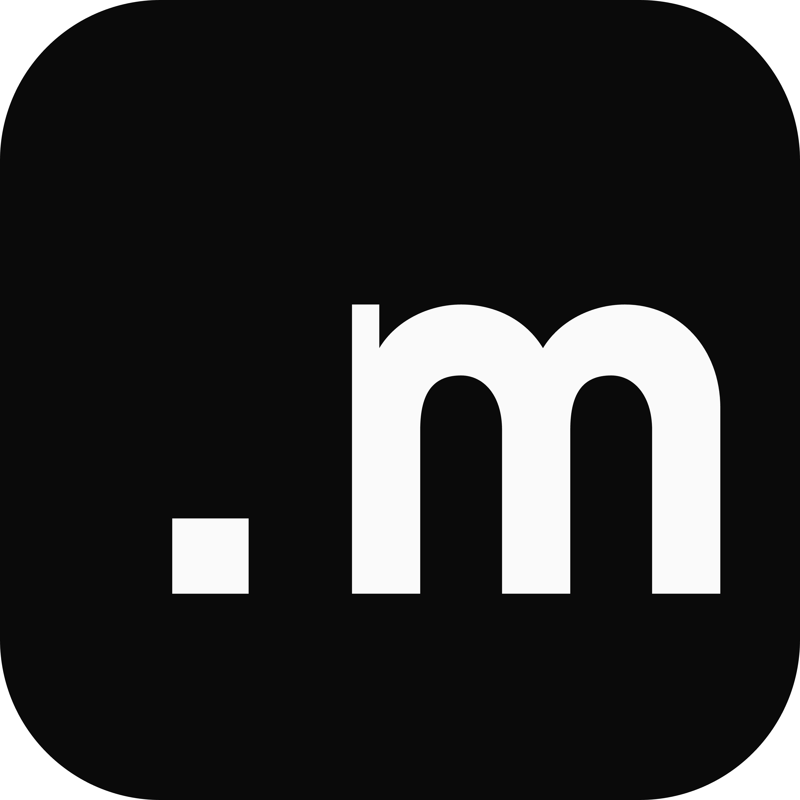

<p>
  <a href="https://github.com/deveix/mockgen/blob/main/LICENSE">
    
  </a>
  <a href="https://github.com/deveix/mockgen/actions">
    
  </a>
  <a href="https://github.com/deveix/mockgen/releases">
    
  </a>
</p>

<div style="display: flex; justify-content: flex-start; align-items: center; gap: 32px; margin-bottom: 16px;">
  <a href="https://mockgen.click/" target="_blank">
    
  </a>
 <h1>Mockgen</h1>
</div>


Easily generate modern App Store & Google Play screenshots with customizable mockups.

[Try me!](https://mockgen.click/)

  <a href="https://mockgen.click/" target="_blank">
    
  </a>

## Features

- Mockup generation for iOS and Android
- Custom backgrounds, text, images, and templates
- Drag-and-drop support to organize screenshots
- High-resolution export (PNG, WebP, AVIF)
- Real-time preview
- Multiple templates and formats supported


## Development

Create a `.env.local` file by copying and filling the file env.example

```
NEXT_PUBLIC_BASE_URL=http://0.0.0.0:3000
NEXT_PUBLIC_API_URL=http://0.0.0.0:3000/api
GOOGLE_FONT_API_KEY=YOUR_API_KEY 
```

Google font is only needed to fetch the fonts, not needed for deployement

** To ensure proper image upload use `http://0.0.0.0:3000` instead of `http://localhost:3000` **

Install dependencies and start the app:

```shell
yarn
yarn dev
```

## Build & Production

### Sync Font
You can fetch the top X fonts of google fonts. By default it take the top 1 hundred

```shell
yarn get-fonts [--max 42] [--subset arabic]
```

To build for production:

```shell
yarn build
yarn start
```

## Usage Example

1. Select a template (iOS, Android, Open Graph, etc.)
2. Add your screenshots or images
3. Customize background, text, and colors
4. Reorder images with drag-and-drop
5. Export your ready-to-publish mockups

## Project Structure

- `app/`: Next.js pages and main logic
- `components/`: UI components and forms
- `lib/`: utilities, templates, SEO
- `public/`: static assets (icons, images, examples)
- `stores/`: state management (template stores)
- `types/`: TypeScript types

MIT License
